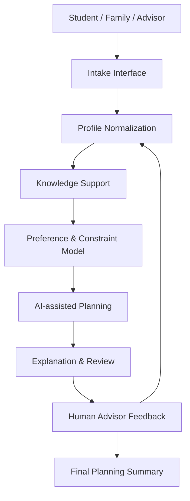
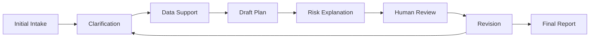

# AI OPC Gaokao Assistant

## Portfolio Note

This repository is a public-safe portfolio case prepared by **QIAN Boyu (Bowie)** for graduate applications in AI, enterprise AI systems, and the **SUTD MSc in Design and Artificial Intelligence for Enterprise (DAI-E)**.

The repository is not intended to publish production code or prove traditional software engineering depth. It presents an early-stage AI product concept through problem framing, workflow design, system architecture, responsible AI boundaries, and portfolio-safe documentation.

Applicant context:

- Legal name: QIAN Boyu.
- Preferred name: Bowie.
- Background: Psychology graduate from the University of Macau.
- Current direction: AI systems builder, enterprise AI workflow designer, and AI OPC founder/operator.

## Project Summary

Chinese Gaokao application planning is a high-pressure, information-dense, and time-sensitive family decision process. Students and parents need to interpret score position, provincial rules, school and major choices, risk levels, family preferences, and fragmented public information within a short decision window.

The AI OPC Gaokao Assistant explores how AI can support this process without replacing human judgment. Its role is to structure information, surface missing inputs, compare risk categories, generate explainable planning summaries, and prepare outputs for review by a human advisor.

## Problem Context

Gaokao application planning is difficult because several factors interact at once:

- Score, rank, and province-specific admission rules affect available choices.
- School reputation and major fit often pull families in different directions.
- Risk gradients need to be explained in language families can understand.
- Parents and students may hold different priorities around location, stability, career direction, and prestige.
- Information asymmetry makes it hard to judge whether advice is reliable.
- The decision window is short, so families often rely on incomplete comparisons.
- Fragmented online content can amplify anxiety instead of improving decisions.

This project treats the application process as a structured decision-support problem rather than a simple chatbot use case.

## My Role

My role in this project is best described as:

- **Co-founder**
- **Product Designer**
- **AI Workflow Designer**

I am responsible for problem framing, user journey design, AI-assisted workflow design, consultation logic, product packaging, and portfolio-safe system documentation. The focus is on AI-assisted prototyping, workflow design, product architecture, LLM-enabled workflow building, and human-in-the-loop decision support.

## Current Implementation Status

This repository documents a public-safe, early-stage portfolio version of the project.

Completed:

- Problem framing
- User decision journey
- Public-safe system architecture
- Human-in-the-loop workflow
- AI-assisted report structure
- Consultation workflow exploration

In Progress:

- Intake form design
- Sample advisory report generation
- Data source and provenance framework
- Advisor review workflow
- User-facing demo materials

Not Included Publicly:

- Private prompts
- Real student cases
- Production code
- Internal scoring rules
- Commercial service materials

## Repository Structure

```text
.
|-- README.md
`-- docs/
    |-- project-overview.md
    |-- system-architecture.md
    |-- workflow.md
    |-- sample-output.md
    |-- data-governance.md
    |-- evaluation-rubric.md
    |-- product-roadmap.md
    `-- sutd-fit.md
```

- [docs/project-overview.md](docs/project-overview.md) explains the problem, target users, AI value, human review needs, current status, and portfolio boundary.
- [docs/system-architecture.md](docs/system-architecture.md) describes the high-level architecture and core system layers.
- [docs/workflow.md](docs/workflow.md) documents the human-in-the-loop planning workflow.
- [docs/sample-output.md](docs/sample-output.md) provides a fictional, synthetic example of a planning summary.
- [docs/data-governance.md](docs/data-governance.md) defines privacy, provenance, and public-safe repository boundaries.
- [docs/evaluation-rubric.md](docs/evaluation-rubric.md) proposes a quality rubric for AI-assisted outputs.
- [docs/product-roadmap.md](docs/product-roadmap.md) outlines staged development from documentation to pilot workflow.
- [docs/sutd-fit.md](docs/sutd-fit.md) explains why the project fits SUTD DAI-E.

## System Overview



The system starts with structured intake, converts user input into a planning profile, supports reasoning with approved knowledge sources, and produces explainable outputs for human review. The feedback loop is intentional: the advisor and family can revise priorities before a final planning summary is produced.

## Human-in-the-loop Workflow



The workflow is designed to prevent premature recommendations. AI helps prepare draft reasoning and structured summaries, while human advisors review assumptions, check uncertainty, and decide whether the output is ready for discussion with the student and family.

## Responsible AI and Safety Boundaries

This project uses AI as a decision-support tool, not as a replacement for human advisors.

- AI does not replace human advisors.
- Outputs require human review before use in consultation.
- Data provenance matters, especially when public information changes.
- Uncertainty must be disclosed instead of hidden behind confident language.
- Synthetic examples only are used in this repository.
- Real student data, parent information, chat records, customer information, API keys, tokens, `.env` files, private prompts, internal scoring rules, and commercial service materials are intentionally excluded.

## Relevance to SUTD MSc DAI-E

This project fits SUTD DAI-E because it connects design, AI, and enterprise workflow thinking in a practical decision-support setting.

- **Design-led problem framing:** The project starts from a real user decision journey, not from a model-first demo.
- **Human-centered AI interaction:** AI is used to clarify, structure, and explain rather than make final decisions.
- **Enterprise-style workflow architecture:** The system separates intake, normalization, knowledge support, planning, review, and output.
- **Responsible AI boundaries:** The portfolio defines privacy, data governance, and review limits clearly.
- **Retrieval-assisted reasoning:** The concept depends on source-aware support rather than unsupported generation.
- **Human-in-the-loop review:** Advisor feedback is part of the workflow, not an optional add-on.
- **Explainable recommendation design:** The goal is to make trade-offs understandable to families and reviewers.

## Next Steps

- Build intake prototype.
- Design advisor dashboard.
- Create sample reports.
- Add source provenance tracking.
- Develop evaluation rubric.
- Prepare pilot consultation workflow.

## Public-Safe Scope

This repository is documentation-only. It is suitable for portfolio review because it shows the design and AI workflow logic while excluding sensitive operational materials.
