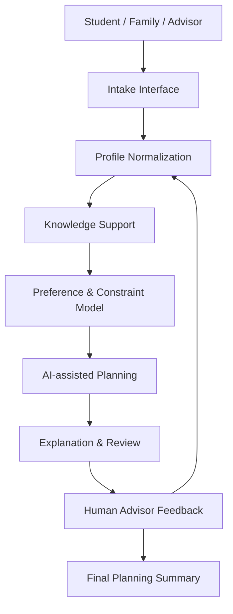

# System Architecture

## High-level Architecture

The AI OPC Gaokao Assistant is designed as a human-in-the-loop decision-support system. It separates intake, profile normalization, knowledge support, preference modeling, AI-assisted planning, explanation, advisor review, and final summary generation.

The architecture is intentionally modular so that each layer can be reviewed, improved, or replaced without treating the AI model as a single black box.

## Intake Layer

The intake layer collects the planning context before any recommendation is drafted.

Public-safe intake categories include:

- Student background.
- Province or regional context.
- Score or rank category, if provided by the user in a private setting.
- Subject direction.
- Major and career interests.
- Preferred regions or cities.
- Family expectations.
- Risk tolerance.

In this repository, no real intake records are included.

## Profile Normalization Layer

The profile normalization layer converts unstructured input into a consistent planning profile. This step helps the system avoid treating incomplete user statements as final facts.

Responsibilities include:

- Separating hard constraints from soft preferences.
- Identifying missing fields.
- Detecting preference conflicts.
- Preparing a structured context for planning.
- Marking assumptions that need confirmation.

## Knowledge Support Layer

The knowledge support layer is responsible for connecting planning discussions to approved information sources. In a future prototype, this layer could support retrieval from public policy pages, institution descriptions, major information, or advisor-curated references.

Design requirements:

- Public or approved sources should be traceable.
- Outdated or uncertain information should be flagged.
- AI-generated interpretation should be separated from source-backed facts.
- Sensitive or unauthorized data should not be used.

## Preference and Constraint Model

The preference and constraint model represents the student's decision conditions in a structured way.

Example categories:

- Academic profile.
- Regional rules and application context.
- School preference.
- Major preference.
- Career direction.
- Location preference.
- Family constraints.
- Risk tolerance.

This public version does not disclose internal weighting logic, scoring parameters, or proprietary recommendation rules.

## AI-assisted Planning Layer

The AI-assisted planning layer supports reasoning and draft generation. It can help compare candidate options, summarize trade-offs, and produce explainable planning narratives.

Public-safe planning outputs may include:

- Conservative category.
- Balanced category.
- Ambitious category.
- Clarification questions.
- Draft explanation notes.
- Advisor review checklist.

The AI layer is not treated as a final decision authority.

## Explanation and Review Layer

The explanation and review layer turns draft planning output into language that can be evaluated by a human advisor and discussed with a family.

Good explanations should show:

- Key assumptions.
- Reasons behind candidate categories.
- Known uncertainty.
- Trade-offs between major, school, location, and risk.
- Questions that still require human judgment.

## Human Advisor Loop

The human advisor loop is a core part of the system. The advisor reviews the AI-assisted draft before it becomes part of consultation output.

Advisor actions may include:

- Correcting profile assumptions.
- Removing unsuitable options.
- Requesting more evidence.
- Rewriting risk explanations.
- Asking the family to clarify priorities.
- Approving a revised summary for discussion.

## Output Summary Layer

The output summary layer prepares a readable final report for the student and family. It should be concise, transparent, and reviewable.

Possible sections:

- Structured intake summary.
- Preference and constraint summary.
- Candidate plan categories.
- Risk explanation.
- Open questions.
- Advisor notes.
- Recommended next actions.

## Limitations

This is a public-safe portfolio version and early-stage prototype documentation.

Current limitations include:

- No public production code.
- No real student data or consultation records.
- No private prompts or scoring rules.
- No claim of automated admission prediction.
- No claim that recommendations are guaranteed.
- No complete deployment, audit, or compliance framework yet.

The next stage is to build a controlled intake prototype and advisor review workflow with clear data governance.
