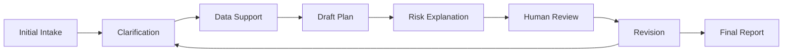

# Workflow

## Workflow Goal

The workflow helps students, families, and advisors move from unclear preferences to a structured, reviewable planning summary. AI supports the workflow by organizing information, drafting explanations, and surfacing uncertainty. Final judgment remains with human users and advisors.

## Step-by-step Workflow

### 1. Initial Intake

The student and family provide basic planning context, including academic background, region, subject direction, major interests, location preferences, family expectations, and risk tolerance.

The system should not generate a final recommendation at this stage. The goal is to collect enough context for structured planning.

### 2. Profile Structuring

The assistant converts raw input into a structured profile.

This includes:

- Hard constraints.
- Soft preferences.
- Missing information.
- Conflicting priorities.
- Assumptions that need confirmation.

### 3. Clarification Questions

If the profile is incomplete or inconsistent, the assistant generates targeted questions.

Examples of clarification areas:

- Whether major fit or school reputation matters more.
- Whether the family prefers stability or higher upside.
- Whether location is a hard constraint.
- Whether certain majors or regions should be excluded.

### 4. Knowledge Retrieval / Public Data Support

The workflow uses public or advisor-approved information to support planning. This may include institution descriptions, major context, policy references, or historical public information.

The system should mark source provenance and distinguish between source-backed facts and AI-generated interpretation.

### 5. Candidate Plan Generation

The assistant drafts candidate plan categories based on the structured profile and available context.

Public-safe categories include:

- Conservative.
- Balanced.
- Ambitious.

This repository does not disclose private scoring formulas, weighting logic, or internal ranking rules.

### 6. Risk Explanation

Each category should include a plain-language risk explanation.

The explanation should address:

- Why the category may fit the profile.
- What trade-offs are involved.
- What assumptions affect the recommendation.
- What uncertainty should be reviewed.

### 7. Human Advisor Review

A human advisor reviews the draft before it is presented as consultation material.

The advisor checks:

- Profile accuracy.
- Source relevance.
- Risk language.
- Missing caveats.
- Whether the plan matches the family priorities.

### 8. Iteration with Student / Family

The student and family respond to the reviewed draft. They may adjust preferences, reject options, add constraints, or request a different risk balance.

The workflow then loops back to clarification or profile structuring.

### 9. Final Summary Report

The final report summarizes:

- Structured profile assumptions.
- Preference and constraint summary.
- Candidate plan categories.
- Key trade-offs.
- Risk notes.
- Advisor review notes.
- Suggested next actions.

The report is a decision-support artifact, not an automated decision.

## Workflow Principles

- Clarify before recommending.
- Keep assumptions visible.
- Separate public data support from AI interpretation.
- Require human review before consultation use.
- Disclose uncertainty in plain language.
- Use only fictional or synthetic examples in public materials.
